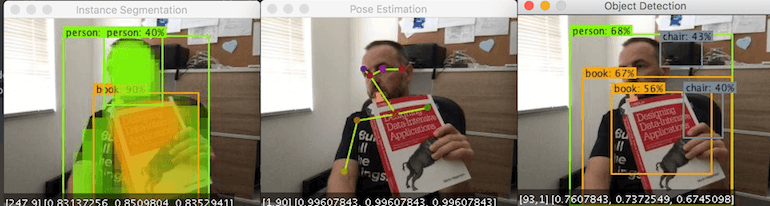

# SpringBoot & Tensorflow Demos 

Spring Boot demo application that leverages the [Tensorflow SCSt App Starters](https://github.com/spring-cloud-stream-app-starters/tensorflow) and [SCSt Computer Vision](https://github.com/tzolov/computer-vision) projects to 
perform `Image-Recognition`, `Object-Detection`, `Image-Segmentation` and `Pose-Estimation`. Under the hood 
the [SpringBootTensorflowDemoApplication](./src/man/java/org/springframework/cloud/stream/app/demo/SpringBootTensorflowDemoApplication.java) spring-boot demo uses the `AggregateApplicationBuilder` for `in-memory` binding  of the existing [Image-Recognition](https://github.com/spring-cloud-stream-app-starters/tensorflow/tree/master/spring-cloud-starter-stream-processor-image-recognition),
 [Object-Detection](https://github.com/spring-cloud-stream-app-starters/tensorflow/tree/master/spring-cloud-starter-stream-processor-object-detection), 
 [Image-Segmentation](https://github.com/spring-cloud-stream-app-starters/tensorflow/tree/master/spring-cloud-starter-stream-processor-object-detection) 
 and [Pose-Estimation]() Tesnerflow app starters.
 
Multiple pre-trained models are available for every task. Check the annotations in the [SpringBootTensorflowDemoApplication](./src/man/java/org/springframework/cloud/stream/app/demo/SpringBootTensorflowDemoApplication.java) class for further details.



# Quick Start

Download the pre-build [spring-boot-tensorflow-demo-0.0.1-SNAPSHOT.jar](https://drive.google.com/file/d/1-_rHqQdcIMOVo0EgXfG2C-n-2w2yi1mP) SpringBoot application and run it form the command line:

```bash
java -jar ./spring-boot-tensorflow-demo-0.0.1-SNAPSHOT.jar --demoType=pose_estimation --server.port=8081
```

Select between following demos: `pose_estimation`, `object_detection`, `image_recognition` and `instance_segmentation`.

* The `pose_estimation`, `object_detection` and `instance_segmentation` pipelines use the web camera for source input and plot the
output in an `Image-Viewer`.
* The `image_recognition` still uses `File` source (listening for new images in the `/tmp/input` folder) and plots the result in an `Image-Viewer`. 


# Build

```bash
git clone https://github.com/tzolov/spring-boot-tensorflow-demo.git
cd ./spring-boot-tensorflow-demo
./mvnw clean install
```

NOTE: Due to the snapshot dependencies on the Tensorflow app starters the desired functionality may not be present.  

  
